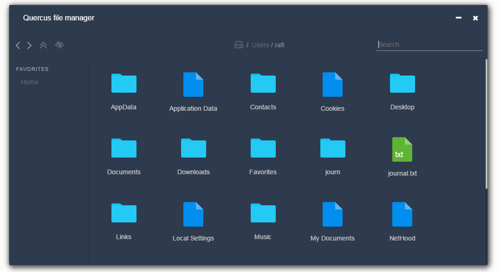

## quercus
 Simple file manager using react and electron. Help is really needed to speed up the developement

## Things to do
- [ ] Remove unused packages
- [ ] Upgrade all packages
- [ ] Reogranize scss using BEM
- [ ] Use fontello instead of font awesome
- [ ] More option to context menu ( properties, Open with)
- [ ] Editable url bar
- [ ] Status bar
- [ ] Displaying list of drives in right
- [ ] Unit testing needed
- [ ] Different views ( details view)
- [ ] Preview thumbnail in case of images and videos
- [ ] Basic shortcust like copy, paste etc..
- [ ] Full search in all drives
- [ ] Ability to connect to FTP
- [ ] Needs git page
- [ ] Configurable theme using external css file
- [ ] New icon needed

Here is the Trello Board https://trello.com/b/ese7aQNR/quercus

## Run
To run it,

`yarn` or `npm install`

and then,

`npm run start` or `npm run start-watch` for livereloading.

## To Build

`npm run build`
